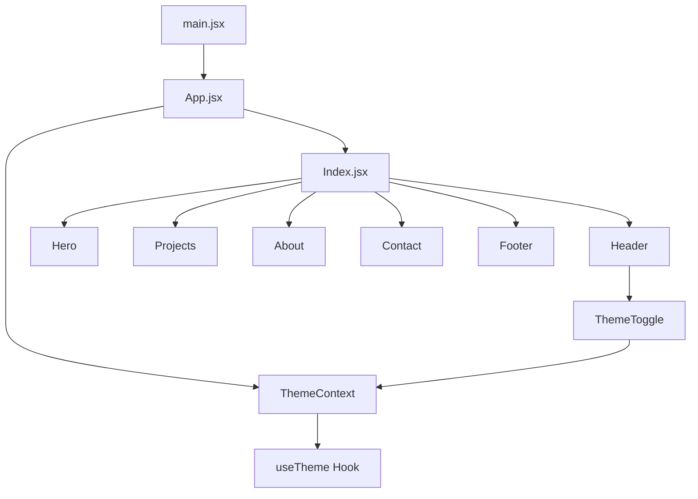

# Portfolio Website Plan - React

## Project Overview
A minimal, clean portfolio website built with React to showcase 2-3 projects with email/social links, featuring dark mode.

---

## Tech Stack
- **Framework**: React (Vite - faster and lighter than Create React App)
- **Styling**: CSS Modules or Tailwind CSS (minimal design)
- **Icons**: Lucide React or Heroicons
- **Deployment**: GitHub Pages (primary hosting solution)
- **Domain**: Namecheap (can connect to GitHub Pages)

---

## Hosting: GitHub Pages

### Why GitHub Pages for Your Portfolio?
- **Free**: Completely free hosting
- **Integrated**: Built into GitHub, no extra account needed
- **Automatic HTTPS**: Free SSL certificate
- **CI/CD**: Automatic deployments on push to branch
- **Custom Domain**: Supports custom domains (with Namecheap)
- **Perfect for Portfolios**: Static sites are ideal for portfolios
- **Simple Setup**: Just push to a branch and enable Pages
- **Industry Standard**: Most developer portfolios use GitHub Pages

### Setup Steps

1. **Create Repository on GitHub**
   - Create a new repository (public or private)
   - Name it `yourusername.github.io` for user site or `yourusername-project` for project site

2. **Enable GitHub Pages**
   - Go to repository Settings → Pages
   - Select source branch (main or master)
   - Choose folder (root or /docs)
   - Click Save

3. **Build Your React App**
   ```bash
   npm run build
   ```
   - This creates the `dist/` folder with production-ready files

4. **Deploy Options**

   **Option A: Manual Deploy (Simplest)**
   - Commit your `dist/` folder to the branch
   - GitHub Pages will serve it automatically

   **Option B: GitHub Actions (Recommended)**
   - Create `.github/workflows/deploy.yml` for automatic builds
   - Push to trigger automatic deployment
   - No manual build steps needed

5. **Configure Custom Domain (Optional)**
   - In Pages settings, add your custom domain
   - In Namecheap Advanced DNS:
     - Add CNAME: `www` → `yourusername.github.io`
     - Add CNAME: `@` → `yourusername.github.io`
   - Wait for DNS propagation (up to 48 hours)

### Configuration Files

**GitHub Actions Workflow (`.github/workflows/deploy.yml`)**:
```yaml
name: Deploy to GitHub Pages

on:
  push:
    branches: [main]

jobs:
  deploy:
    runs-on: ubuntu-latest
    steps:
      - uses: actions/checkout@v3
      - uses: actions/setup-node@v3
        with:
          node-version: '18'
          cache: 'npm'
      - run: npm ci
      - run: npm run build
      - uses: peaceiris/actions-gh-pages@v3
        with:
          github_token: ${{ secrets.GITHUB_TOKEN }}
          publish_dir: ./dist
```

**Required Files**:
- `.github/workflows/deploy.yml` - GitHub Actions workflow
- `package.json` - Ensure `npm run build` script exists
- `README.md` - Required for GitHub Pages

### Important Notes
- GitHub Pages only serves static files (HTML, CSS, JS)
- Build your React app before deploying (`npm run build`)
- The `dist/` folder contains the production-ready files
- GitHub Actions can automate the build and deploy process
- Base URL configuration may be needed for nested repositories

### Troubleshooting Common Issues
- **404 errors**: Check that `dist/` folder is built and committed
- **Custom domain not working**: Verify DNS records at Namecheap
- **Build errors**: Check Node.js version compatibility in `package.json`
- **403 errors**: Ensure repository is public or you have proper permissions

---

## Component Architecture

```
src/
├── components/
│   ├── Header/
│   │   ├── Header.jsx
│   │   └── ThemeToggle.jsx
│   ├── Hero/
│   │   └── Hero.jsx
│   ├── Projects/
│   │   └── Projects.jsx
│   ├── About/
│   │   └── About.jsx
│   ├── Contact/
│   │   └── Contact.jsx
│   ├── Footer/
│   │   └── Footer.jsx
│   └── SocialLinks/
│       └── SocialLinks.jsx
├── context/
│   └── ThemeContext.jsx
├── hooks/
│   └── useTheme.js
├── pages/
│   └── Index.jsx
├── App.jsx
└── main.jsx
```

---

## Pages/Sections

### 1. Header
- Logo/Name
- Navigation links (About, Projects, Contact)
- **Theme toggle button** (light/dark mode)

### 2. Hero Section
- Introduction
- Brief bio
- Call-to-action button (View Projects)

### 3. Projects Section
- Grid of 2-3 project cards
- Each card includes:
  - Project title
  - Brief description
  - Tech stack used
  - Links to live demo and code

### 4. About Section
- Personal bio
- Skills list
- Education/Certifications (optional)

### 5. Contact Section
- Email link
- Social media links (GitHub, LinkedIn, Twitter, etc.)

### 6. Footer
- Copyright
- Simple credits

---

## Design System (Minimal)

### Color Palette

**Light Mode**:
- Background: #ffffff / #f5f5f5
- Text: #1a1a1a / #333333
- Cards: #ffffff / #fafafa
- Accent: #007bff (blue) or #00b894 (teal)

**Dark Mode**:
- Background: #121212 / #1e1e1e
- Text: #e0e0e0 / #b0b0b0
- Cards: #1e1e1e / #2d2d2d
- Accent: #4fc3f7 (light blue) or #00e676 (light teal)

### Typography
- Clean sans-serif font (Inter, Roboto, or system fonts)
- Good line height for readability

### Spacing
- Generous whitespace
- Consistent padding/margins

### Dark Mode Features
- Theme toggle in header
- Smooth transitions between themes
- System preference detection (prefers-color-scheme)
- Local storage to remember user preference

---

## Development Steps

1. **Setup Project**
   - Initialize Vite React project
   - Install dependencies
   - Configure build tools

2. **Create Theme System**
   - Set up ThemeContext for global theme state
   - Create useTheme hook
   - Implement theme toggle component

3. **Create Components**
   - Build each component individually
   - Test components in isolation with both themes

4. **Implement Styling**
   - Apply minimal design principles
   - Ensure responsive design
   - Implement dark mode styles

5. **Add Content**
   - Populate with your actual content
   - Customize colors and fonts

6. **Test & Refine**
   - Test on different devices
   - Test theme switching
   - Optimize performance

7. **Deploy to GitHub Pages**
   - Create GitHub repository
   - Push code to repository
   - Enable GitHub Pages in settings
   - Configure GitHub Actions workflow (optional)
   - Set up custom domain at Namecheap (optional)
   - Verify deployment

---

## File Structure

```
website-portfolio/
├── public/
│   └── favicon.ico
├── src/
│   ├── components/
│   │   ├── Header/
│   │   │   ├── Header.jsx
│   │   │   └── ThemeToggle.jsx
│   │   ├── Hero/
│   │   │   └── Hero.jsx
│   │   ├── Projects/
│   │   │   └── Projects.jsx
│   │   ├── About/
│   │   │   └── About.jsx
│   │   ├── Contact/
│   │   │   └── Contact.jsx
│   │   ├── Footer/
│   │   │   └── Footer.jsx
│   │   └── SocialLinks/
│   │       └── SocialLinks.jsx
│   ├── context/
│   │   └── ThemeContext.jsx
│   ├── hooks/
│   │   └── useTheme.js
│   ├── pages/
│   │   └── Index.jsx
│   ├── App.jsx
│   ├── main.jsx
│   ├── index.css
│   └── utils/
│       └── data.js (for project data)
├── .github/
│   └── workflows/
│       └── deploy.yml
├── .gitignore
├── index.html
├── package.json
├── vite.config.js
└── README.md
```

---

## Data Structure Example

```javascript
// src/utils/data.js

export const projects = [
  {
    id: 1,
    title: "Project Name",
    description: "Brief description of what the project does",
    techStack: ["React", "Node.js", "MongoDB"],
    demoUrl: "https://example.com",
    codeUrl: "https://github.com/yourusername/project",
    image: "/project1.jpg"
  },
  // ... more projects
];

export const skills = [
  "React",
  "JavaScript",
  "HTML/CSS",
  // ... more skills
];

export const socialLinks = {
  email: "your.email@example.com",
  github: "https://github.com/yourusername",
  linkedin: "https://linkedin.com/in/yourusername",
  twitter: "https://twitter.com/yourusername"
};
```

### Theme Configuration

```javascript
// src/context/ThemeContext.jsx

const themeConfig = {
  light: {
    background: '#ffffff',
    cardBackground: '#fafafa',
    text: '#1a1a1a',
    secondaryText: '#666666',
    accent: '#007bff',
    border: '#e0e0e0'
  },
  dark: {
    background: '#121212',
    cardBackground: '#1e1e1e',
    text: '#e0e0e0',
    secondaryText: '#b0b0b0',
    accent: '#4fc3f7',
    border: '#333333'
  }
};
```

---

## Component Flow Diagram



---

## Next Steps

1. Initialize Vite React project
2. Create theme system (Context + Toggle)
3. Create component structure
4. Implement each section
5. Add your content
6. Test and deploy to GitHub Pages

---

## GitHub Pages Deployment Checklist

- [ ] Create GitHub repository
- [ ] Push initial code to repository
- [ ] Enable GitHub Pages in repository settings
- [ ] Build project (`npm run build`)
- [ ] Commit `dist/` folder or configure GitHub Actions
- [ ] Verify Pages is accessible at `https://yourusername.github.io`
- [ ] (Optional) Set up custom domain in Pages settings
- [ ] (Optional) Configure DNS at Namecheap
- [ ] (Optional) Create GitHub Actions workflow for auto-deploy

---

## Questions to Consider

### Hosting Questions
- **GitHub Pages**: Best for portfolios, integrated with GitHub, free
- **Recommendation**: Use GitHub Pages exclusively for simplicity and integration

### Dark Mode Questions
- Should dark mode be the default or require toggle?
- Do you want to respect system preference by default?
- Any specific color preferences for dark mode?

### Layout Questions
- Should projects be in a grid or list layout?
- Any specific animations or transitions?
- Do you want a blog section in the future?

### Content Questions
- What are the 2-3 project names you want to showcase?
- What's your name and brief bio?
- What skills do you want to highlight?
- What are your social media links?
